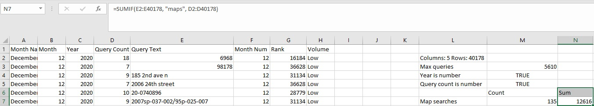
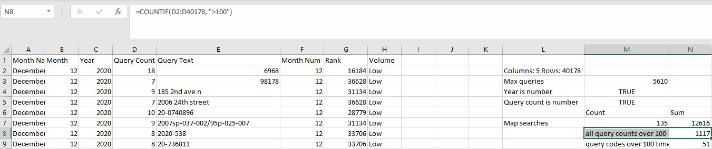

# nash-gov-monthly-searches-project

# Introduction
In this project I wanted to look at the top 500 monthly searches in Nashville to see what people searched for most, and report back any interesting findings.

Data Sources: [Top 500 Monthly Searches](https://data.nashville.gov/Public-Services/Nashville-gov-Top-500-Monthly-Searches/fuaa-r5cm)

# Table of Contents
* [Introduction](#Introduction)
* [Excel Walkthrough](#Excel-Walkthrough)

# Excel Walkthrough
1. When loading in the file, there are 5 columns and 40178 rows total. The years 2014-2020 are covered in the dataset.

2. After loading in the dataset, I wanted to find how many queries in total were run for all years combined. For this, I used the `MAX` function and referenced the `Query Count` column to get the total queries.

3. Next, I wanted to see what the top five searches were in the dataset, so I filtered by the `Query Count` column, making sure to only select the five rows with the highest count. The second highest search seems to be a test, while the top search being directory.

4. For the next step, I wanted to check and make sure that the first `Year` and `Query Count` column cells were numerical. I checked this by using the `ISNUMBER` function, and both cells are numerical.

5. Next, I wanted to find out the number of months the word "maps" was searched for in the dataset. I used the `COUNTIF` function and as my criteria, I put the word "maps".

6. Next, I wanted to find out how many times people searched for the word "maps" in the dataset. I used the `SUMIF` function and as my criteria, I put the word "maps". For the `sum_range` part of the function, I put the `Query Count` column to get the total sum queries where the word "maps" was searched.

7. Next, I wanted to find the average number of times that "maps" was searched in the months that it appeared in the dataset. I used the `AVERAGEIF` function and as my criteria, I put the word "maps". For the `average_range` part of the function, I put the `Query Count` column to get the average number of times "maps" was searched for the months it appeared.

8. Next, I wanted to find the maximum number of times that "maps" was searched in any month. I used the `MAXIFS` function and for my `criteria_range` part of the function, I used the `Query Text` column. As with the steps before, I used the word "maps" as my criteria to find the max times "maps" was searched in any given month.

9. For the next step I wanted to rank the values in the `Query Count` column, and to do this I need to use the `RANK` function, making sure to use an absolute reference so that every row is counted in the rank.

10. Next, I wanted to experiment with the `VLOOKUP` function, so I created a lookup table for the different months of the year. In the function, I referenced the `Month Name` column. Afterwards I made an absolute reference to the lookup table, making sure to limit the `col_index_num` to two.

11. For the next step, I wanted to count how many times a query was run more than 100 times in a given month, so I used the `COUNTIF` function. In the function I reference the `Query Count` column and make my criteria ">100".

12. For the next step, I wanted to find the number of times users searched for "codes" more than 100 times in a given month, so I used the `COUNTIFS` function. My `criteria_range1` is the `Query Count` column, and my `criteria1` is ">100", this is what will get me every query count over 100. Next, my `criteria_range2` is the `Query Text` column, and my `criteria2` is "codes". This insures that I am only returning the number of times users searched "codes" over 100 times.

13. For the final step, I wanted to make a column that could break the `Query Count` into three separate pieces. Those being low, medium, and high query counts. To do this, I used the `IFS` function. I wrote the `IFS` function so that if the query count was less than or equal to 50, it would give a value of `Low`, if the query count was less than or equal to 100, it would give a value of `Medium`, and finally if the query count was greater than 100, it would give a value of `High`.

